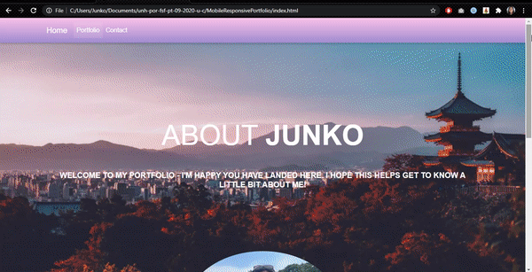

### :wave: Hello there! My name is Junko.

I would love to welcome you to my portfolio to get to know a little about me and to see my recently completed projects during my time enrolled in UNH's Full Stack Web Development Bootcamp.

Feel free to reach out if you have any questions or would like to chat.

#### Skills

Deployed Link to Repository: https://junkoyama.github.io/MobileResponsivePortfolio/

Final Result: 

This homework taught me to challenge myself using different layouts, formatting and contents from Bootstrap. I created a navigation bar that directs viewers via navigation tabs to my 'About Me' on the home page, to 'My Portfolios' page on the Portfolio nav tab, and to my 'Contact' nav tab which allows users to enter their information with me via a form. The rows and column formatting is still challenging to me but I did enjoy creating a website that is more aesthetically pleasing than my first HTML website assignment.

This homework assignment was about teaching the class how to build responsive websites using Bootstrap and HTML, and how to design a web page that is both desktop and mobile friendly. 
